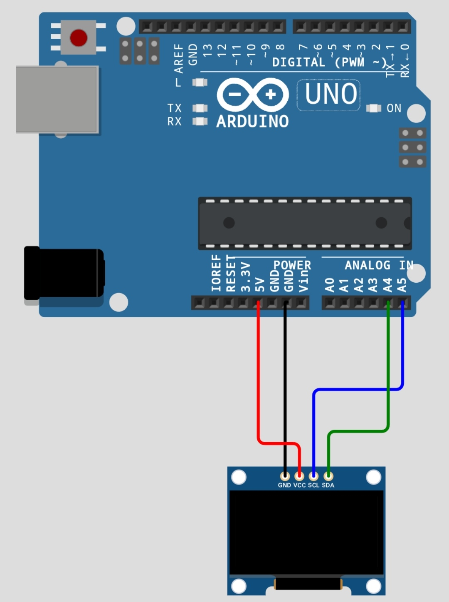

# arduino-uno-image-display-SSD1306
## Preparation

1. Arduino Uno r3

2. Display OLED SSD1306

## Connection

- VCC -> 5v

- GND -> GND

- SCL -> A5

- SDA -> A4
## wiring
 
## code
https://github.com/fajarjulyana/arduino-uno-image-display-SSD1306/blob/566c8e919664b465406774a53a4a6ebd99673857/src/code.cpp#L1-L112
## Result

